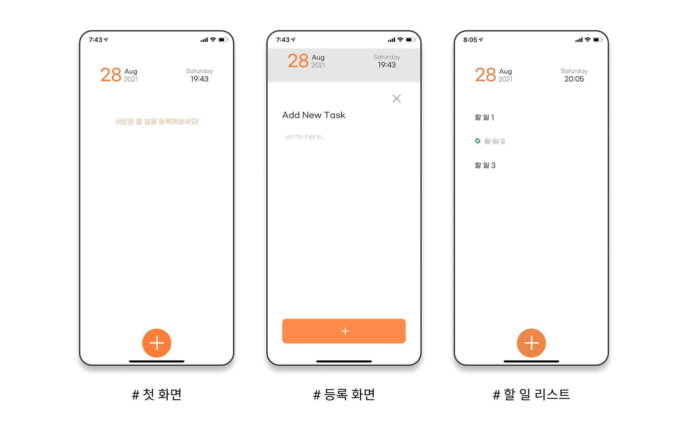
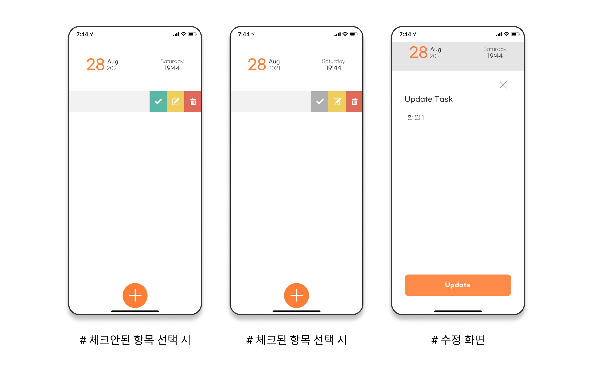

# TS-TODO

https://uhyun-fe.github.io/ts-todo/

## 개요

-  Typescript 학습을 위해 만든 todo-list application

## 실행

```
npm install
npm start
```

## Setting

```
npx create-react-app ts-todo --template typescript
npm install styled-components @types/styled-components styled-normalize gh-pages
```

## 실행 화면




## 참고

-  [디자인 참고 사이트 1](https://medium.muz.li/todo-list-inspiration-a1d736c2718a#.p9kc7wuc8)
-  [디자인 참고 사이트 2](https://dribbble.com/shots/6635602-Todo-List-App?utm_source=Pinterest_Shot&utm_campaign=mhdesigner&utm_content=Todo+List+App&utm_medium=Social_Share)
